# 谱图理论入门 · P1 综合笔记

!!! note "人话总结（阅读前先看这句）"
    这份笔记用线性代数的视角（特征值 / 特征向量）入门谱图理论，从矩阵基础一路讲到拉普拉斯矩阵 $L=D-A$ 的核心直觉。适合准备学习 GNN、图信号处理，或想快速复习“图如何变成矩阵、矩阵如何读出图的性质”的读者。

> 用**线性代数**研究**图**的性质：图是有“特征值（谱）”的。
>
> 本笔记由两份学习材料融合整理而成：
> 1. **《谱图理论入门笔记 P1》**（原始学习文档：无向图、邻接矩阵、度、拉普拉斯矩阵）
> 2. **《特征值 & 特征向量 —— 超容易理解》**（学习上面文档时补的基础线性代数）
>
> 目标：**深入浅出、层层递进**，方便日后快速复习。所有原始配图均已保留。

!!! note "人话总结"
    这份笔记的核心是“把图翻译成矩阵（A、D、L），再用线性代数读图”。重点吃透三点——①实对称矩阵可正交对角化；②拉普拉斯矩阵 $L=D-A$；③$(L\mathbf{f})_i=\sum_{j\sim i}(f_i-f_j)$ 即“中心值 − 邻居平均”。适合在学 GNN / 图信号处理前打底，或作为快速复习卡。

---

## 目录

- [〇、先建立全局认识（学习路线图）](#〇先建立全局认识学习路线图)
- [一、线性代数基础：特征值与特征向量](#一线性代数基础特征值与特征向量)
  - [1.1 特征向量：乘了矩阵方向不变的向量](#11特征向量乘了矩阵方向不变的向量)
  - [1.2 特征值：方向不变时，长度被放大/缩小的倍数](#12特征值方向不变时长度被放大缩小的倍数)
  - [1.3 实对称矩阵的两条关键性质](#13实对称矩阵的两条关键性质)
  - [1.4 手算实战：2×2 矩阵的特征值与特征向量](#14手算实战22矩阵的特征值与特征向量)
  - [1.5 对话精华：补齐几个“看似简单但容易卡住”的概念](#15对话精华补齐几个看似简单但容易卡住的概念)
- [二、图的基础表示：从“度”到“邻接矩阵”](#二图的基础表示从度到邻接矩阵)
  - [2.1 无向图 G = (V, E)](#21无向图gve)
  - [2.2 度（Degree）：一个顶点连了几条边](#22度degree一个顶点连了几条边)
  - [2.3 连通图 vs 非连通图](#23连通图vs非连通图)
  - [2.4 光靠“度”不够 → 引出邻接矩阵](#24光靠度不够引出邻接矩阵)
  - [2.5 邻接矩阵 A](#25邻接矩阵a)
  - [2.6 度矩阵 D](#26度矩阵d)
  - [2.7 非连通图的“块结构”](#27非连通图的块结构)
- [三、谱图理论核心：实对称矩阵的对角化](#三谱图理论核心实对称矩阵的对角化)
  - [3.1 性质1：实对称矩阵相加减，仍是实对称矩阵](#31性质1实对称矩阵相加减仍是实对称矩阵)
  - [3.2 拉普拉斯矩阵 L = D − A](#32拉普拉斯矩阵lda)
  - [3.3 性质2：实对称矩阵必可对角化 A = PΛPᵀ](#33性质2实对称矩阵必可对角化apλpᵀ)
  - [3.4 “超容易理解”逐句拆解 + 原文笔误纠正](#34超容易理解逐句拆解原文笔误纠正)
  - [3.5 性质3~8：零特征值、正交性、代数/几何多重性](#35性质38零特征值正交性代数几何多重性)
- [四、拉普拉斯矩阵 L 到底“做了什么”（重点）](#四拉普拉斯矩阵l到底做了什么重点)
  - [4.1 元素级定义](#41元素级定义)
  - [4.2 L 右乘一个“顶点函数”向量 f](#42l右乘一个顶点函数向量f)
  - [4.3 推导过程](#43推导过程)
  - [4.4 最直观的理解：离散拉普拉斯算子 = 中心值 − 邻居平均](#44最直观的理解离散拉普拉斯算子中心值邻居平均)
- [五、速查总结 & 两篇文献的衔接](#五速查总结两篇文献的衔接)
  - [5.1 一页速查表](#51一页速查表)
  - [5.2 为什么这套理论“有用”](#52为什么这套理论有用)
  - [5.3 两篇文献如何衔接](#53两篇文献如何衔接)
- [参考资料](#参考资料)

## 〇、先建立全局认识（学习路线图）

谱图理论说白了就是一句话：

> **把“图”翻译成“矩阵”，再用线性代数（特征值/特征向量）去研究图的性质。**

所以学习顺序天然分成三层，本文也按这个顺序组织：

```
第①层  线性代数基础          特征值、特征向量、对角化
   ↓
第②层  图的矩阵表示          无向图、度、邻接矩阵 A、度矩阵 D
   ↓
第③层  谱图理论的核心        拉普拉斯矩阵 L = D − A，及其对角化与“作用”
```

> 💡 **一句话记住**：图 → 矩阵（A、D、L）→ 特征值/特征向量（谱）→ 图的性质（连通性、平滑度……）。
> 后面你会在很多地方看到：**图的“连通分量个数” = 拉普拉斯矩阵 L 的“0 特征值个数”**。这是谱图理论最经典的结论之一，本文第 4 节会埋下伏笔。

---

## 一、线性代数基础：特征值与特征向量

> 这一部分来自《特征值 & 特征向量 —— 超容易理解》。它是理解谱图理论的**钥匙**：因为邻接矩阵 A、度矩阵 D、拉普拉斯矩阵 L 都是**实对称矩阵**，而实对称矩阵有着最“nice”的特征值/特征向量性质。

### 1.1 特征向量：乘了矩阵方向不变的向量

**定义（几何直觉优先）**：一个向量 **v** 乘上一个矩阵 A，如果结果 **Av** 和 **v** 还是**同一个方向**（只是变长或变短），那么 **v** 就是 A 的**特征向量**。

- 图1：Av（橘色箭头）方向被改变了（和绿色 v 不同向）→ **v 不是**特征向量。
- 图2：Av（橘色箭头）方向没变（和绿色 v 同向）→ **v 是**特征向量。

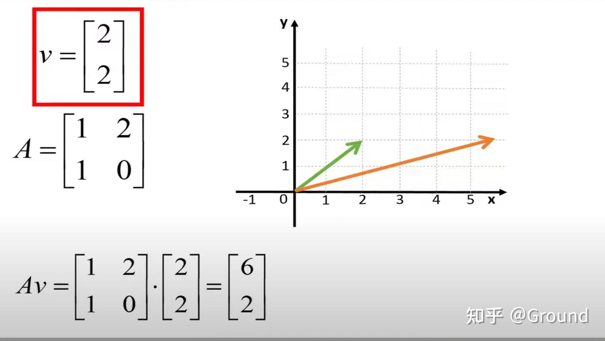
*图1：Av 的方向为橘黄色箭头，改变了 v 的方向（绿色箭头），故 v 不是矩阵 A 的特征向量。*

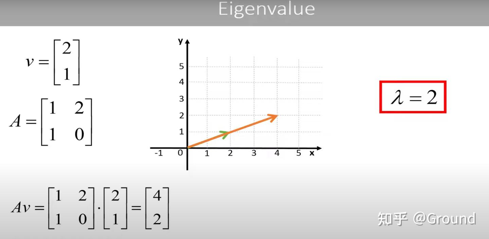
*图2：Av 的方向为橘黄色箭头，没有改变 v 的方向（绿色箭头），故 v 是矩阵 A 的特征向量；且 Av 是 v 的 2 倍，所以特征值 λ = 2。*

几个要点：

- **特征向量不包括零向量**：因为任何矩阵乘以零向量都等于零向量，这个“不变向”没有意义。
- **共线向量都是特征向量**：所有与某个特征向量共线（同向或反向）的非零向量，也都是特征向量。它们一起构成一个**特征子空间**。
  - 例如图2 中 v = [4, 2]（是 [2,1] 的 2 倍）同样也是 A 的特征向量。

### 1.2 特征值：方向不变时，长度被放大/缩小的倍数

**定义**：特征值是那个“倍数” λ，满足

$$A\mathbf{v} = \lambda \mathbf{v}$$

- 图2 中 Av = 2v，所以特征值 λ = 2。
- **特征值可以是 0**，但**特征向量绝不可以是零向量**（见图4）。

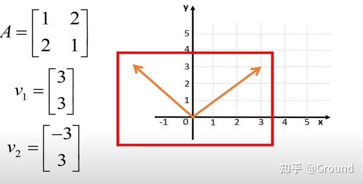
*图3：2×2 实对称矩阵有两个方向的特征向量，且相互正交（夹角 90°）。*

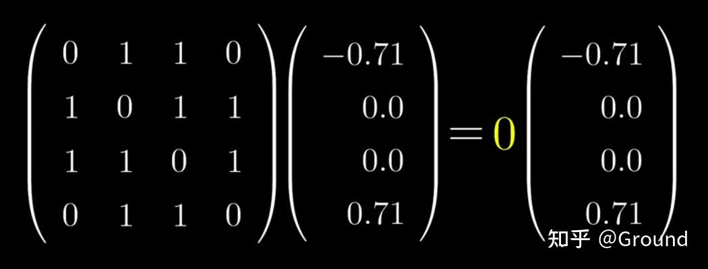
*图4：特征值可以为 0（注意：特征向量本身仍不能是零向量）。*

> ⚠️ **易错点**：特征值 λ = 0 是允许的（意思是 Av = 0，矩阵把特征向量“压扁”到原点）；但特征向量 v 永远 ≠ 0。

### 1.3 实对称矩阵的两条关键性质

这是谱图理论能成立的根基，请务必记住：

1. **实对称矩阵的特征值全都是实数**（不是复数）。
2. **n×n 实对称矩阵有 n 个特征向量方向，且两两相互正交**（夹角 90°）。
   - 2×2 的例子见图3。

> 因为 A、D、L 都是实对称矩阵，所以它们的特征向量一定可以选成**两两正交**的一组，这正是后面“正交矩阵 P”“对角化”能成立的原因。

### 1.4 手算实战：2×2 矩阵的特征值与特征向量

我们想解 $A\mathbf{v} = \lambda \mathbf{v}$。在等式左边乘一个单位矩阵 I（任何向量乘以 I 都不变），得到：

$$A\mathbf{v} = \lambda I \mathbf{v} \quad\Longrightarrow\quad (A - \lambda I)\mathbf{v} = \mathbf{0}$$

- 如果 $(A - \lambda I)$ **可逆**，那么只有零解 $\mathbf{v} = \mathbf{0}$，但特征向量不能是零向量。
- 所以 $(A - \lambda I)$ 必须**不可逆**，而“不可逆”等价于**行列式为 0**：

$$\det(A - \lambda I) = 0$$

这就是**特征方程（特征多项式）**。解出 λ 就是特征值，再代回求 v 就是特征向量。

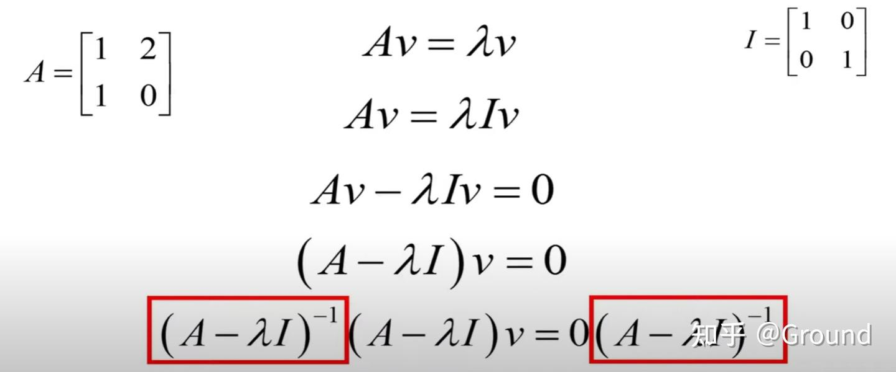
*图5：如果 A−λI 可逆则 v 为零向量（矛盾），故 A−λI 不可逆，即 $\det(A-\lambda I)=0$。*

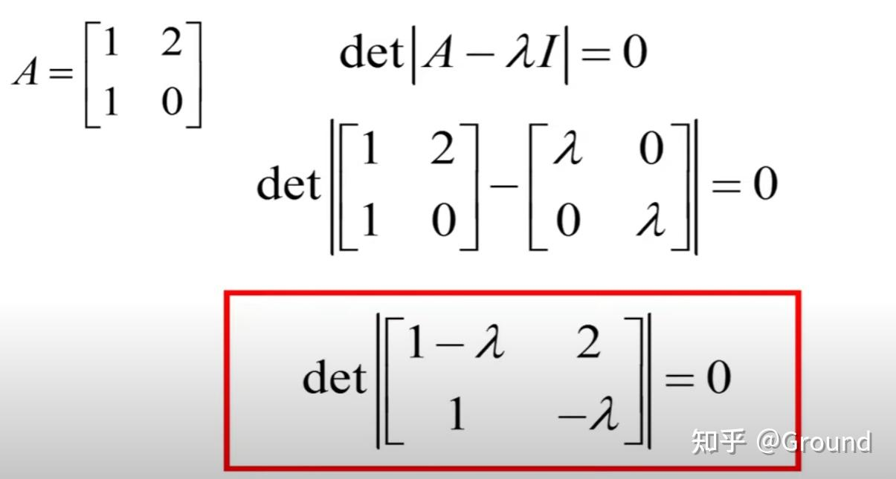
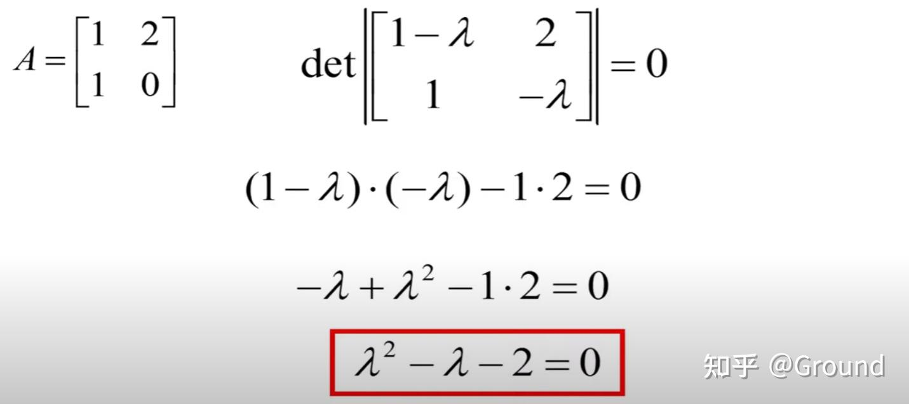
*图6、图7：令 $\det(A-\lambda I)=0$，解出两个特征值 λ = 2 和 λ = −1。*

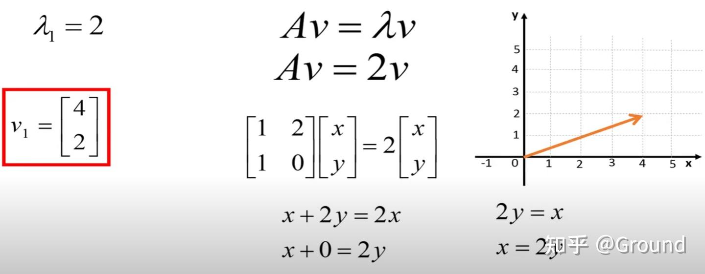
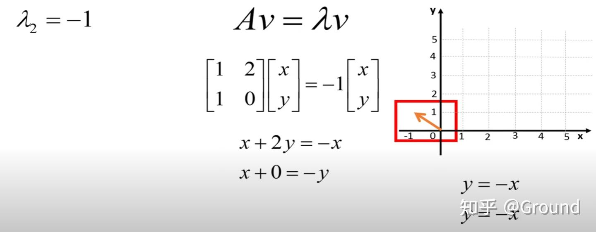
*图8、图9：把每个特征值代回 $(A-\lambda I)\mathbf{v}=\mathbf{0}$，解出对应的特征向量。*

> 🧮 **小结计算流程**：①写出 $A-\lambda I$ → ②令 $\det(A-\lambda I)=0$ 解出所有 λ → ③逐个 λ 代回解 $(A-\lambda I)\mathbf{v}=0$ 得特征向量。

### 1.5 对话精华：补齐几个“看似简单但容易卡住”的概念

在学习过程中，借助 AI 讨论了几个前置概念，这里整理成“即用即查”的小卡片。

**① 单位矩阵 I（类比数字 1）**
- 主对角线全为 1、其余全为 0 的方阵。
- 核心性质：$A I = I A = A$（任何矩阵乘单位矩阵等于它自己）。
- 例子：$I_2 = \begin{bmatrix}1&0\\0&1\end{bmatrix}$。

**② 向量“正交” = 点积为 0**
- 两个向量 **u、v** 的点积（内积）为 0，则称它们正交（几何上就是“垂直”）。
- 例：$\mathbf{u}=(1,0),\ \mathbf{v}=(0,1)$，点积 $=1·0+0·1=0$，正交。
- 若再要求每个向量长度都为 1，则叫**标准正交（单位正交）**。正交矩阵 P 的列向量正是“两两正交且长度均为 1”的单位特征向量，所以才有 $P^T P = I$。

**③ 向量的长度（模 / 范数）怎么算**
- 对 $\mathbf{v}=(v_1,v_2,\dots,v_n)$：$\|\mathbf{v}\| = \sqrt{v_1^2+v_2^2+\cdots+v_n^2}$。
- 例：$\mathbf{v}=(3,4)\Rightarrow \|\mathbf{v}\|=\sqrt{9+16}=5$（就是勾股定理）。
- **单位向量**：长度恰为 1 的向量。
- **归一化**：任意非零向量 $\mathbf{v}$ 除以自身长度得到单位向量 $\mathbf{u}=\dfrac{\mathbf{v}}{\|\mathbf{v}\|}$。

**④ 什么是对角化（Diagonalization）**
- 把“复杂矩阵 A”用 $A = P\Lambda P^T$ 表示，其中中间 $\Lambda$ 是**只有对角线有值的对角矩阵**。
- 好处：
  - 所有特征值整齐排在 $\Lambda$ 对角线上，一眼看清“谱”；
  - 算幂超简单：$A^k = P\Lambda^k P^T$（对角矩阵的幂 = 每个对角线元素分别取 k 次方）；
  - 在图分析中，可通过特征值判断图的连通性、连通分量个数。
- 直观理解：原矩阵 A 是在“标准坐标系”下的变换；正交矩阵 P 相当于**旋转到一个新坐标系（特征向量方向）**，在那里 A 的表现就只是“每个轴单独伸缩 λ 倍”，没有任何旋转/扭曲——所以变得像对角矩阵一样简单。

> ⚠️ **经典混淆（来自对话）**：有人会问“A 不是 n×n 实对称矩阵吗？怎么又是对角矩阵了？”
> 关键区分：**A 是被对角化的“原矩阵”（通常非对角）**；**Λ 是分解后出现的“对角矩阵”（特征值排对角）**。两者是不同的矩阵！
>
> | 矩阵 | 是否对角？ | 说明 |
> |---|---|---|
> | 原矩阵 A（邻接/度/拉普拉斯） | **通常非对角** | 描述图的结构 |
> | 特征值矩阵 Λ | **是对角矩阵** | 从 A 提取出的特征值 |
> | 正交矩阵 P | 不是对角矩阵 | 存放特征向量 |
>
> 对角化不是“把 A 改成对角阵”，而是“**在特征向量构成的坐标系下看 A，它表现得像个对角阵 Λ**”。

---

## 二、图的基础表示：从“度”到“邻接矩阵”

> 本节约等于《谱图理论入门笔记 P1》的“第 1 节 基础图理论”。我们默认讨论的是**无向图**（边没有方向）。

### 2.1 无向图 G = (V, E)

一个无向图由**所有顶点 V** 和**所有边 E** 组成。

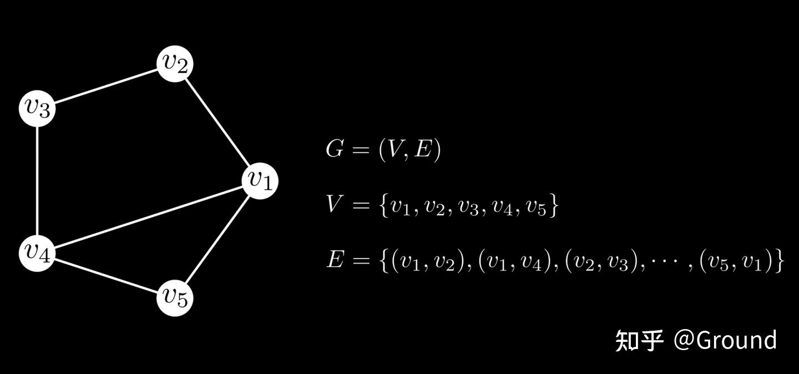
*图4：无向图 G 是由所有顶点 V 和所有边 E 组成的。*

### 2.2 度（Degree）：一个顶点连了几条边

**度** = 一个顶点的“邻居数量”或“连接数”。

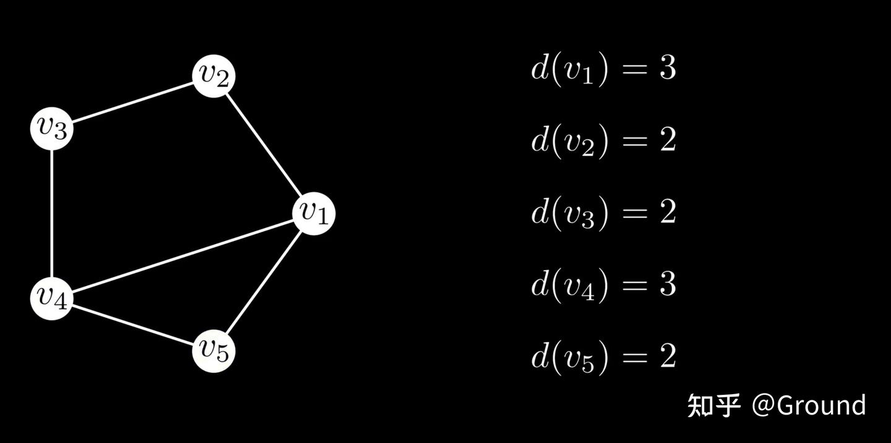
*图5：顶点的度是指顶点的邻居或者连接的数量。*

### 2.3 连通图 vs 非连通图

- **连通图**：从任意一个顶点出发，都能走到任意另一个顶点。
- **非连通图**：存在“走不过去”的顶点；它由若干个**连通分量**拼成（图7 有两个分量）。

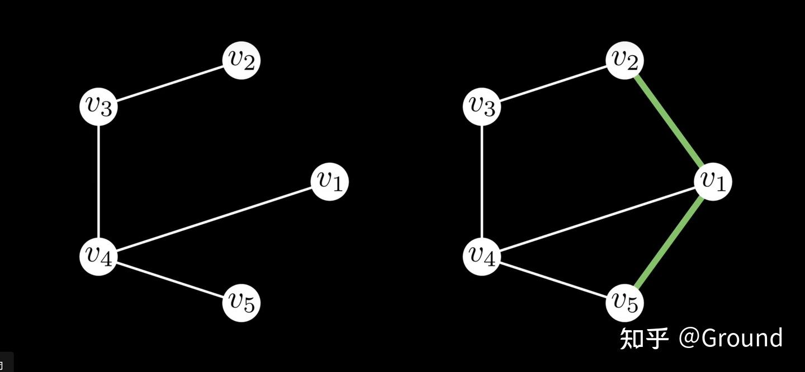
*图6：两个图都为连通图。*

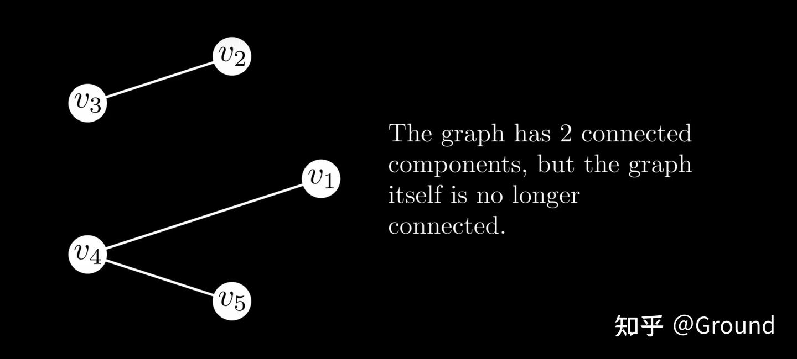
*图7：非连通图，有两个相连的分量。*

### 2.4 光靠“度”不够 → 引出邻接矩阵

注意一个反直觉的事实：**只看每个顶点的度，无法唯一确定一张图**。下面两张图顶点的度信息完全相同，但连接结构不一样：

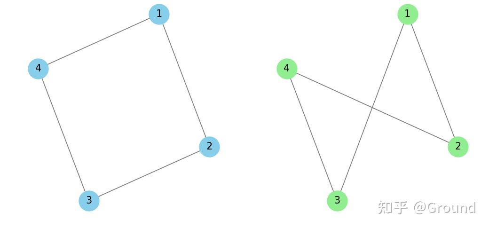
*图8：度的信息完全相同的两个图（结构却不同）——光靠度无法重建图。*

> 结论：度只能描述“每个点连了几条”，但描述不了“具体和谁连”。要完整捕捉连接信息，需要**邻接矩阵 A**。

### 2.5 邻接矩阵 A

**定义**：如果顶点 i 和顶点 j 之间有一条边，则 $A_{ij}=1$，否则 $A_{ij}=0$。

**关键性质：A 一定是实对称矩阵。** 因为无向图中“i 连 j”等价于“j 连 i”，所以 $A_{ij}=A_{ji}$。

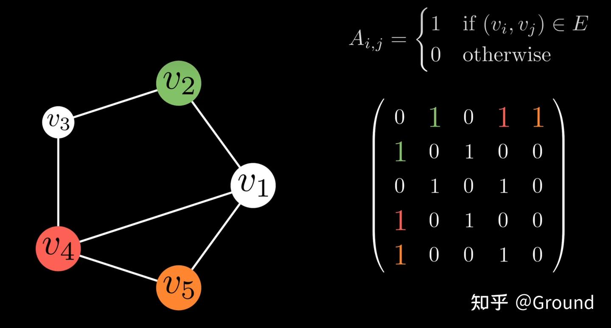
*图9：图 G 的邻接矩阵如 A 所示（关于主对角线对称）。*

### 2.6 度矩阵 D

把邻接矩阵**每一行“1”的个数**（即每个顶点的度）沿主对角线排成一个对角矩阵，就是**度矩阵 D**。D 在主对角线位置记录每个顶点的度，其余位置为 0。

**D 也是实对称矩阵**（对角矩阵天然对称）。

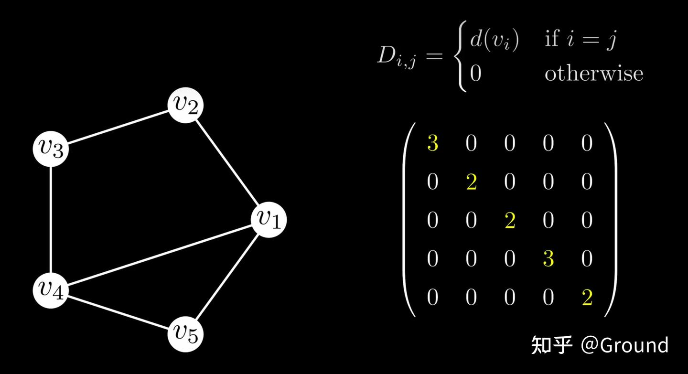
*图10：度矩阵（对角线是每个顶点的度，其余为 0）。*

### 2.7 非连通图的“块结构”

对于非连通图，邻接矩阵会出现**块结构（分块对角）**——每个连通分量对应一块，块外全是 0。这种块结构会深刻影响矩阵的特征值与特征向量（后面会反复用到）。

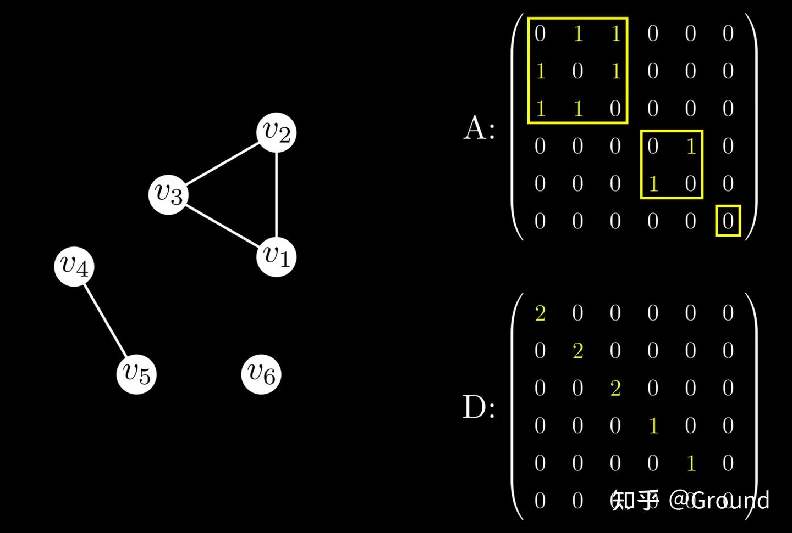
*图11：非连通图的邻接矩阵呈现块结构，这种结构对特征值/特征向量影响很大。*

---

## 三、谱图理论核心：实对称矩阵的对角化

> 本节约等于《谱图理论入门笔记 P1》的“第 2 节 线性代数基础”。目标：把 A、D、L 这些实对称矩阵“对角化”，从而拿到它们的谱。

### 3.1 性质1：实对称矩阵相加减，仍是实对称矩阵

实对称矩阵之间做加法或减法，结果还是实对称矩阵。这是下面定义拉普拉斯矩阵的基础。

### 3.2 拉普拉斯矩阵 L = D − A

**定义**：拉普拉斯矩阵

$$L = D - A$$

即“度矩阵 − 邻接矩阵”。由性质1 可知，**L 也是实对称矩阵**。

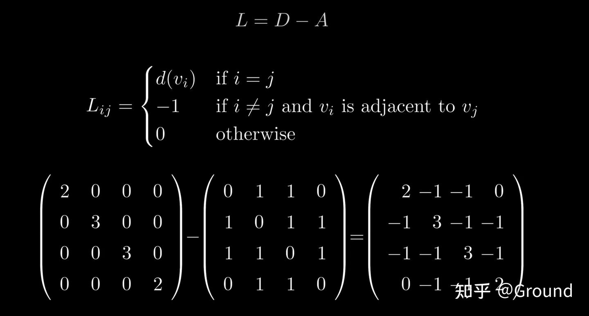
*图14：度矩阵 D 减去邻接矩阵 A 得到拉普拉斯矩阵 L。*

> 💡 L 是谱图理论的“主角”。它把图的结构（谁连谁、连了几条）压缩进一个矩阵里，下一步就能用特征值研究图了。

### 3.3 性质2：实对称矩阵必可对角化 A = PΛPᵀ

**定理（谱定理 / 实对称矩阵可对角化）**：任意 $n\times n$ 实对称矩阵 $A=A^T$，都能被一个正交矩阵 P 对角化：

$$A = P \Lambda P^T$$

其中：
- $P$ 是**正交矩阵**（即 $P^T P = I$），它的列是 A 的**互相正交的单位特征向量**；
- $\Lambda$ 是**对角矩阵**，对角线元素就是 A 的**特征值**（全部为实数）。

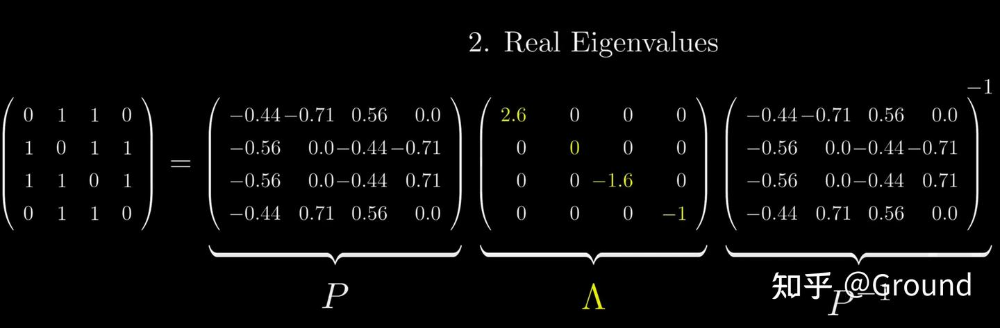
*图12：实对称矩阵可对角化定理——复杂矩阵在特征向量坐标系下变成对角阵 Λ。*

### 3.4 “超容易理解”逐句拆解 + 原文笔误纠正

原文有一句通俗注解：

> “$P$ 里面的每一个列向量是实对称矩阵 A，$\Lambda$ 的每一个元素是对应该矩阵 A 和该列特征向量的特征值。如图13。”

这句话**原文漏写了“的特征向量”五个字**（已在与 AI 的对话中确认）。正确完整的表述应为：

> ✅ “$P$ 里面的每一个列向量是实对称矩阵 **A 的特征向量**，$\Lambda$ 的每一个元素是对应该矩阵 A 和该列特征向量的特征值。”

逐句拆解：

1. **“$P$ 的每一列是 A 的特征向量”**：把 $P$ 的第 k 列记作 $\mathbf{p}_k$，则它满足 $A\mathbf{p}_k=\lambda_k\mathbf{p}_k$。
2. **“$\Lambda$ 的每个元素是对应的特征值”**：$\Lambda$ 对角线上的 $\lambda_k$ 与 $P$ 的第 k 列 $\mathbf{p}_k$ **一一对应**。

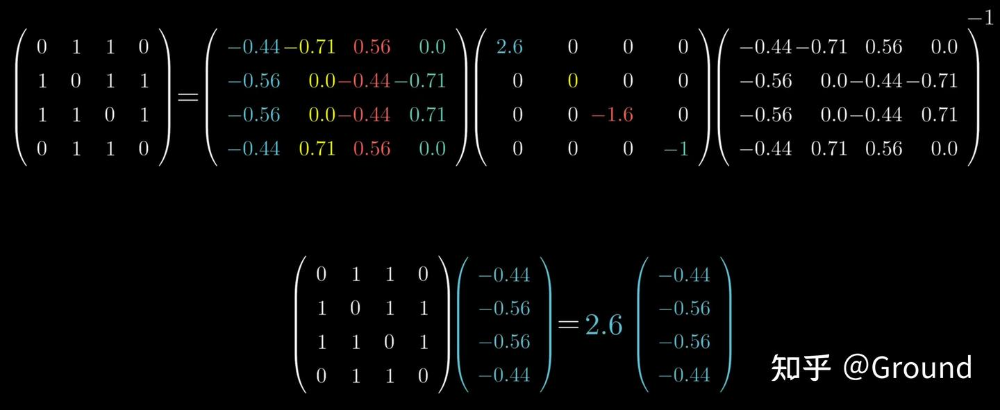
*图13：可对角化定理拆解。蓝色列向量是左侧白色矩阵（实对称矩阵）的一个特征向量，2.6 是该列向量对应的特征值。把所有特征向量按列排成 P、特征值按对应位置排成 Λ，就得到 $A = P\Lambda P^T$。*

> 🔑 **一句话记忆**：对角化就是把“每个特征向量 $\mathbf{p}_k$ 和它对应的特征值 $\lambda_k$”按顺序整齐排列：
> - $P$ 里放**特征向量**（按列）；
> - $\Lambda$ 里放**特征值**（按对角线）；
> - 第 k 列特征向量 ↔ 第 k 个特征值，位置一一对应。
>
> 因此 $A$ 对特征向量 $\mathbf{p}_k$ 的作用，就是简单地把它拉伸 $\lambda_k$ 倍——在特征向量构成的坐标系里，A 变得像对角阵一样简单。

### 3.5 性质3~8：零特征值、正交性、代数/几何多重性

下面是谱图理论常用的几条性质（配合原图理解）：

- **性质3：特征值可以为 0，特征向量不可以为零向量。**（呼应第 1.2 节）
- **性质4：这些特征向量两两正交，即任意两个特征向量的点积为 0。**

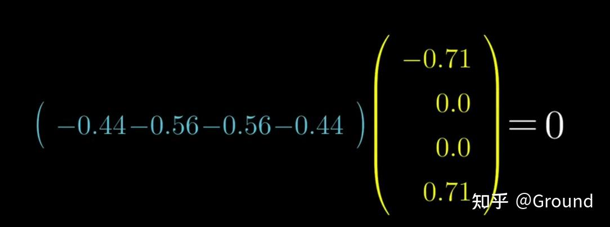
*图15：取图13 的两个特征向量做点积操作，结果为 0，验证了“正交”。*

- **性质5：代数多重性**——某个特征值作为特征多项式根出现的次数。

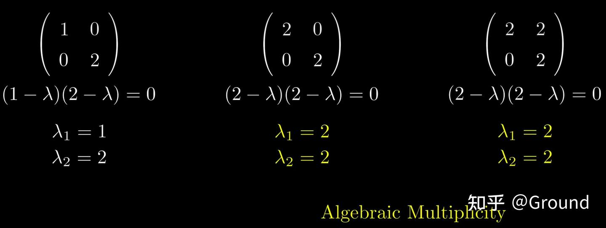
*图16：三个矩阵分别求特征值，后两个矩阵的特征值 2 作为根出现两次，代数多重性 = 2；第一个矩阵两个特征值的代数多重性都是 1。*

- **性质6：几何多重性**——属于该特征值的**线性无关特征向量个数**（= 特征空间的维数）。

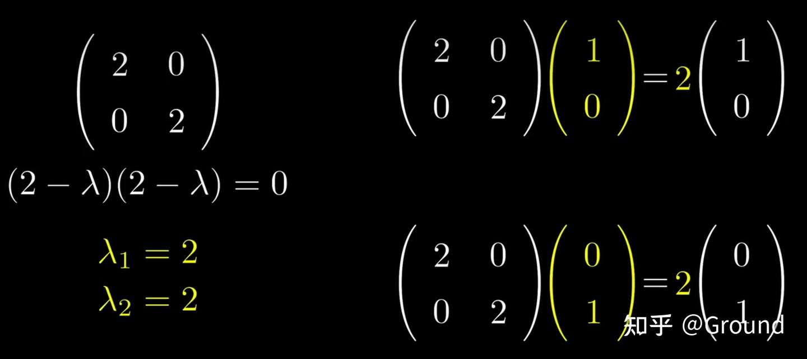
*图17：根据该特征值可求得两个相互正交的特征向量，几何多重性 = 2。*

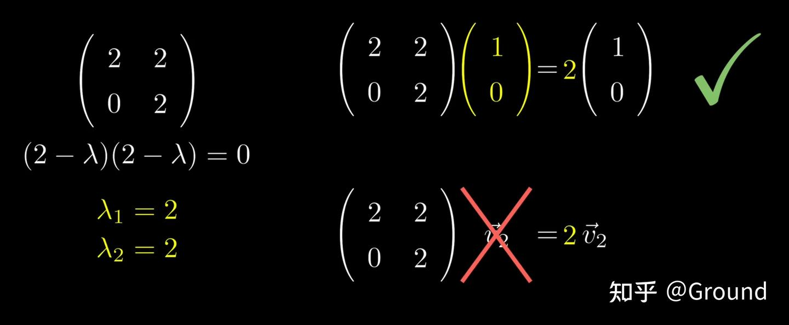
*图18：根据该特征值仅能求得一个特征向量，几何多重性 = 1。*

- **性质7：代数多重性 ≥ 几何多重性。**

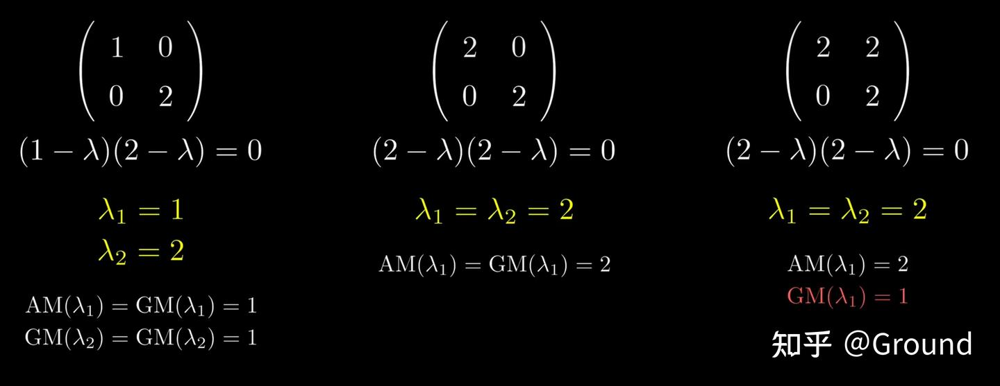
*图19：代数多重性 ≥ 几何多重性。*

- **性质8：若矩阵可对角化，则所有特征值的代数多重性 = 几何多重性**（图19 左侧两个矩阵即如此）。

> 🧠 **重要回顾**：**实对称矩阵永远可对角化**（性质2），而邻接矩阵 A、度矩阵 D、拉普拉斯矩阵 L 都是实对称矩阵。所以：
> - 它们一定有 n 个实特征值；
> - 特征向量一定能选成两两正交；
> - 代数多重性 = 几何多重性。
> 这三条让谱图理论的计算特别“干净”。

---

## 四、拉普拉斯矩阵 L 到底“做了什么”（重点）

> 本节约等于《谱图理论入门笔记 P1》的“第 3 节 拉普拉斯矩阵 L”。这是全篇最该记住的公式，请看到脑子里。

### 4.1 元素级定义

给定 n 个顶点的简单图 G，拉普拉斯矩阵按元素定义为：

$$L_{ij} = \begin{cases} d_i & i = j \\ -1 & i \ne j \text{ 且 } i\sim j\ (\text{相邻}) \\ 0 & \text{其他} \end{cases}$$

它等价于 **$L = D - A$**，因此也是实对称矩阵。

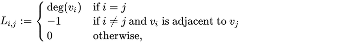
*图20：拉普拉斯矩阵的元素级定义（对角为度，相邻为 −1，其余为 0）。*

### 4.2 L 右乘一个“顶点函数”向量 f

设想给图上每个顶点定义一个标量值（比如每个顶点处的**温度**），这些数值排成一个向量 **f**，则 $L\mathbf{f}$ 的第 i 个分量有非常具体的意义。

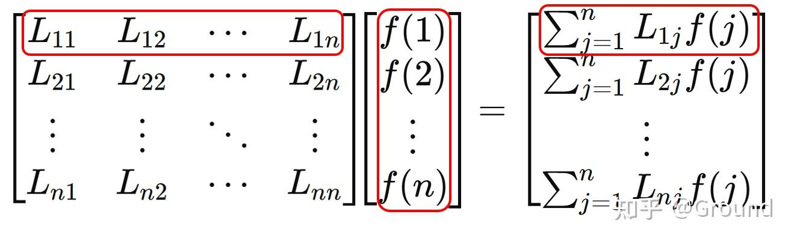
*图21：拉普拉斯矩阵 L 右乘顶点函数向量 f 的结果（逐顶点看）。*

### 4.3 推导过程

因为 $L = D - A$，对第 i 个顶点：

$$(L\mathbf{f})_i = (D\mathbf{f} - A\mathbf{f})_i$$

- 左边度矩阵 D 是对角阵，只有 $i=j$ 时有值，所以 $(D\mathbf{f})_i = d_i f_i$（$d_i$ 是顶点 i 的度）。
- 右边邻接矩阵 A 只在“i 与 j 相邻”时为 1，所以 $(A\mathbf{f})_i = \sum_{j\sim i} f_j$（对所有邻居 j 求和）。

于是：

$$(L\mathbf{f})_i = d_i f_i - \sum_{j\sim i} f_j$$

又因为 $d_i$ 就是 i 的邻居个数，可写成 $d_i = \sum_{j\sim i} 1$，所以 $d_i f_i = \sum_{j\sim i} f_i$。代入展开：

$$(L\mathbf{f})_i = \sum_{j\sim i} f_i - \sum_{j\sim i} f_j = \sum_{j\sim i}(f_i - f_j)$$

### 4.4 最直观的理解：离散拉普拉斯算子 = 中心值 − 邻居平均

把上面的结果再除以度数 $d_i$，得到：

$$\frac{1}{d_i}(L\mathbf{f})_i = f_i - \frac{1}{d_i}\sum_{j\sim i} f_j$$

> **$(L\mathbf{f})_i$ = 顶点 i 的函数值，与其每一个邻居的函数值之差的总和。**
>
> 更直观：**$(L\mathbf{f})_i$ 衡量的是“顶点 i 的值，和它邻居的平均值差多少”**。

这正是**离散版本的拉普拉斯算子**（连续情形 $\Delta f$ 衡量函数的“凹凸/扩散”程度）：

- 如果图上 f 很“平滑”（i 和邻居差不多），$(L\mathbf{f})_i$ 接近 0；
- 如果 i 处是个“尖峰”（和邻居差异大），$(L\mathbf{f})_i$ 就大。

> 🌡️ **物理直觉（温度扩散）**：把 f 想成各点温度，则 $L\mathbf{f}$ 表示“每点相对于其邻居平均温度的偏差”。热量总从高温流向低温，正是沿着让 $L\mathbf{f}$ 趋于 0 的方向演化——这就是拉普拉斯矩阵在图神经网络、图信号处理里无处不在的原因。

> 🔗 **和第 3 节伏笔呼应**：因为 L 的每一行元素之和为 0（对角 $d_i$ 减去 $d_i$ 个 −1 的邻居），所以**全 1 向量 $\mathbf{1}$ 满足 $L\mathbf{1}=0$**，即 $\mathbf{1}$ 是 L 的**特征向量、对应特征值 0**。更进一步：**L 的 0 特征值个数 = 图的连通分量个数**（每个连通分量贡献一个这样的特征向量）。这正是“非连通图块结构影响特征值”的深层原因，也是谱图理论判断连通性的核心工具。

---

## 五、速查总结 & 两篇文献的衔接

### 5.1 一页速查表

| 概念 | 一句话 | 关键公式 / 性质 |
|---|---|---|
| 特征向量 | 乘矩阵后**方向不变**的向量 | $A\mathbf{v}=\lambda\mathbf{v}$，且 $\mathbf{v}\ne \mathbf{0}$ |
| 特征值 | 方向不变时长度被放大的**倍数** | λ 可以为 0；实对称矩阵的特征值全为实数 |
| 实对称矩阵 | 转置等于自己 | 特征向量可取到 **n 个且两两正交** |
| 对角化 | 用特征向量坐标把矩阵变简单 | $A=P\Lambda P^T$（Λ 对角=特征值，P 列=单位特征向量） |
| 无向图 | 边无方向 | G=(V,E) |
| 度 | 一个顶点连了几条边 | $d_i$ |
| 邻接矩阵 A | 相邻为 1，否则 0 | 实对称 |
| 度矩阵 D | 对角线上放各顶点的度 | 对角阵、实对称 |
| 拉普拉斯 L | 度 − 邻接 | $L=D-A$，实对称 |
| L 的作用 | 中心值 − 邻居平均 | $(L\mathbf{f})_i = \sum_{j\sim i}(f_i-f_j)$ |
| 0 特征值 | 对应一个连通分量 | L 的 0 特征值个数 = 连通分量数 |

### 5.2 为什么这套理论“有用”

- **连通性**：看 L 的 0 特征值个数就知道图有几个连通分量（块结构）。
- **平滑度 / 聚类**：特征值大小反映图的结构“频率”；最小的非零特征值（Fiedler 值）与图的连通好坏密切相关。
- **计算便利**：实对称矩阵永远可对角化，特征向量正交，工程上极易数值求解。

### 5.3 两篇文献如何衔接

| 《特征值&特征向量》讲 | 《谱图理论 P1》用在哪里 |
|---|---|
| 什么是特征向量 | 正交矩阵 P 的列向量 |
| 什么是特征值 | 对角阵 Λ 的对角线元素 |
| 实对称矩阵特征向量正交 | 正交矩阵定义 $P^T P=I$ 的依据 |
| 特征值可为 0 | 拉普拉斯矩阵有 0 特征值（对应连通分量） |
| 对角化 $A=P\Lambda P^T$ | 拿到图的“谱”，研究图性质 |

> 两篇配合阅读效果最佳：先懂“矩阵有特征值”，再看“图也能变成矩阵”，最后用特征值读懂图。

---

## 参考资料

- [《谱图理论入门笔记 P1 —— 无向图，邻接矩阵，度，拉普拉斯矩阵》](https://zhuanlan.zhihu.com/p/1942245411227174116)（知乎专栏）
- [《特征值 & 特征向量 —— 超容易理解》](https://zhuanlan.zhihu.com/p/1941846759375639788)（知乎专栏）
- [视频：谱图理论入门](https://www.bilibili.com/video/BV1fbrNYXE35/)（哔哩哔哩）

> 参考资料链接最后核对：2026-07-21。
>
> 如有错误，还请温柔指出。
